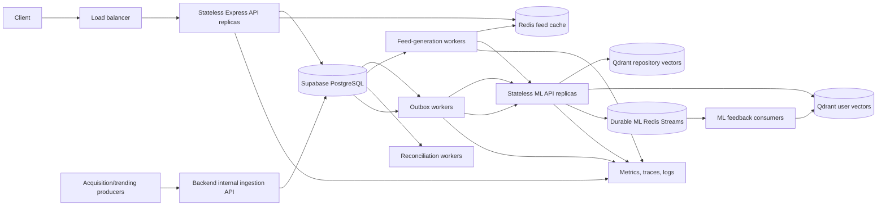
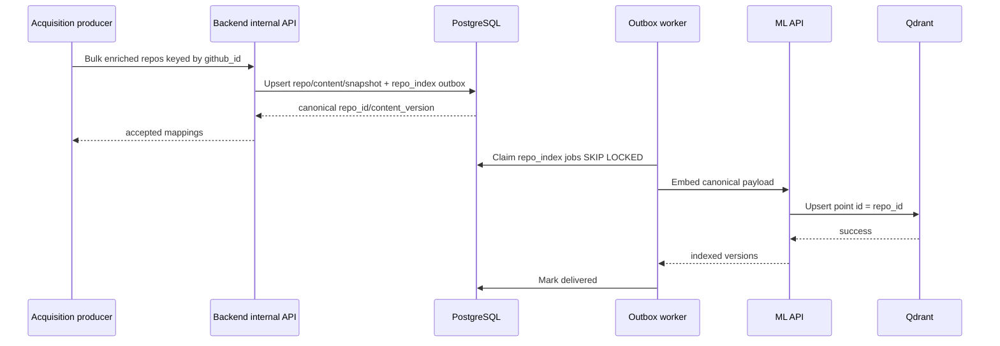

# WEave Backend–ML Production Integration and Scale Plan

**Status:** Final backend implementation plan  
**Last reconciled:** 2026-07-14  
**Repositories reviewed:** `gh-social` and `gh-social-ml`  
**Source documents:** `ML_SYSTEM_ARCHITECTURE.md` and `revised_schema_cutover.md`  
**Two-person execution companion:** [`BACKEND_ML_TWO_PERSON_WORKSPLIT.md`](./BACKEND_ML_TWO_PERSON_WORKSPLIT.md)

## 1. Executive decision

The current backend and checked-out ML service do not yet form one production-safe system. The target design is valid only after the following boundaries are enforced:

1. PostgreSQL is the source of truth for users, repositories, social state, feed provenance, interactions, aggregate product counters, and durable integration work.
2. The backend is the only online service allowed to mutate product PostgreSQL state.
3. Redis feed data is a disposable acceleration layer, not the system of record.
4. Durable backend-to-ML work originates in a PostgreSQL outbox and is delivered at least once.
5. Qdrant is the ML-owned source of truth for repository vectors and user-interest vectors.
6. Online recommendation generation and feedback learning must work without an ML `DATABASE_URL`.
7. Every repository is identified across PostgreSQL, Redis, HTTP, telemetry, and Qdrant by the backend's immutable `repo_id` UUID.
8. Every interaction has an immutable event ID and a backend-assigned per-user feedback version so retries and out-of-order delivery cannot apply ML learning twice.

The existing “two-day cutover” must not be executed as written. This document replaces it with an expand, backfill, verify, shadow, cut over, and contract sequence.

## 2. Scope

This document is intentionally backend-focused. It covers:

- Express API behavior in `gh-social/backend`.
- PostgreSQL schema ownership and migration.
- Redis feed caching, reservations, locks, and work queues.
- Backend worker processes.
- Backend contracts with the FastAPI ML service.
- Backend-controlled repository ingestion and trending synchronization.
- Feed generation, serving, interaction processing, feedback delivery, failure recovery, observability, scaling, testing, and rollout.

It does not prescribe UI structure. Client behavior appears only where the backend contract requires IDs, retry semantics, sessions, or event fields. Internal ML implementation appears only where the backend needs a guaranteed API or delivery behavior.

## 3. Reconciled implementation status

Two architectures are represented by the inputs and repositories:

| Area | Checked-out implementation | Required production state |
|---|---|---|
| Product database | Legacy `public` tables with live/Drizzle drift | Versioned `app` and `telemetry` schemas managed by committed migrations |
| Activity writes | Iterative updates followed by fire-and-forget ML HTTP calls | One idempotent database transaction plus durable outbox |
| Feedback vocabulary | Backend emits more actions than checked-out ML accepts | One versioned shared action contract |
| Feed queue | Backend Redis list with a short TTL | Versioned per-user queues with reservation/commit and request idempotency |
| Feed provenance | Response is an array without a durable serve identity | `feed_serves` and ordered `feed_serve_items` |
| Repository identity | UUID, `owner/name`, and derived Qdrant IDs are mixed | Backend UUID everywhere; GitHub numeric ID is the external uniqueness key |
| Online ML retrieval | Checked-out ML still reads `Repo` and trending tables | Qdrant-only online retrieval and ranking |
| ML recommendation cache | Checked-out ML contains `user_recommendation_batches` code | Backend Redis is the sole online feed-cache owner |
| ML feedback | Checked-out ML updates Postgres and deduplicates by stream message ID | ML updates Qdrant only and deduplicates by event/version |
| Trending | Transitional ML service writes Postgres directly | Backend owns snapshots; Qdrant receives versioned payload refreshes |
| Production durability | Redis failures can fall back to process memory | No silent in-memory fallback in production |

The new ML architecture document describes a PR #37-style production boundary. Those behaviors are not present in the checked-out `fix/feed` branch as reviewed. Therefore this plan treats the behavior as a prerequisite and acceptance contract, not as already-deployed functionality.

### 3.1 Validation baseline at review time

- `gh-social/backend` does not compile because `activityService.ts` expects a `rowCount` property not exposed by the current Drizzle/Postgres result type.
- No backend TypeScript unit or integration test files were found.
- The checked-out ML test suite did not finish within 120 seconds and had already reported feedback-test failures.
- The checked-out ML branch still contains online Postgres reads/writes and lacks several files described as part of the PR #37-style target.

These are Phase 0 blockers. New schema and distributed-flow work must not be layered on a failing baseline without first isolating and fixing the existing failures.

## 4. Non-negotiable invariants

### 4.1 Ownership invariants

- Only the backend and backend workers hold the product database role.
- Online ML has no product PostgreSQL credentials.
- Offline utilities never create or alter product tables at runtime.
- Only the backend changes likes, dislikes, saves, follows, comments, boards, counters, feed versions, sessions, serves, events, and outbox rows.
- Only ML changes Qdrant repository vectors, user vectors, and model-specific payload fields.
- Only the backend owns user delivery queues and feed invalidation.

### 4.2 Identity invariants

- `app.repos.repo_id` is an immutable UUID and is the canonical cross-system repository identity.
- `github_id BIGINT` is the authoritative external uniqueness key used for upsert and rename handling.
- `github_node_id TEXT` may be stored as an additional external identifier.
- `full_name` is mutable presentation/routing data, never telemetry identity.
- The Qdrant point ID is exactly `repo_id`; no second UUID5 transformation is applied.
- `user_id` is the Supabase Auth UUID everywhere.
- `event_id`, `feed_request_id`, `serve_id`, `generation_id`, `outbox_id`, and `session_id` are UUIDs with distinct meanings.

### 4.3 Delivery invariants

- A successful interaction response means the event, product-state transition, feed-version change, and outbox row are committed.
- A successful ML feedback response means the event was durably accepted for processing, not necessarily learned synchronously.
- Backend-to-ML delivery is at least once.
- ML application is effectively once through per-user feedback versions stored with the Qdrant user point.
- Duplicate client events do not duplicate telemetry, product mutations, counters, feed invalidation, outbox work, or ML learning.
- An old feed generation result is never installed after a newer interaction changed the user's feed version.

### 4.4 Feed semantics

- A serve record means the backend prepared a response; it does not prove the card was visible.
- An impression event proves the configured visibility threshold was met.
- A dwell event is separate from an impression and carries bounded milliseconds.
- “Ignored” is derived asynchronously after an attribution window, never at response time.
- Redis loss may reduce personalization or force regeneration but must not corrupt product state.

## 5. Target system architecture



### 5.1 Deployable backend processes

Use one codebase but separate process roles:

| Process | Responsibility | Scaling signal |
|---|---|---|
| `api` | Authentication, request validation, product reads/writes, feed responses | HTTP concurrency, p95 latency, CPU |
| `outbox-worker` | Deliver feedback, onboarding, repository-index, and trending-refresh jobs | Ready outbox rows, oldest-row age |
| `feed-worker` | Generate and prewarm user feeds; coalesce cache misses | Generation queue depth, ML latency |
| `reconcile-worker` | Repair Redis reservations, counters, stale locks, and terminal work | Repair backlog and schedule lag |
| `retention-worker` | Create/drop partitions and prune completed operational data | Partition schedule and storage growth |

Do not run durable workers only as untracked `void` promises inside API replicas. API deploys and autoscaling must not interrupt ownership of queued work.

## 6. PostgreSQL target model

Create `app` and `telemetry` beside the existing `public` schema. Do not rename or drop legacy objects during the expand phase.

### 6.1 `app` schema

| Table | Purpose and minimum contract |
|---|---|
| `app.users` | `user_id UUID PK` referencing `auth.users`, username/profile fields, status, created/updated timestamps |
| `app.user_stats` | One row per user; product counters only; recomputable |
| `app.user_feed_state` | `user_id PK`, monotonic `feed_version`, monotonic `feedback_version`, timestamps |
| `app.topics` | Normalized topic catalog |
| `app.user_topics` | User-topic membership/strength |
| `app.repos` | `repo_id UUID PK`, `github_id BIGINT UNIQUE`, optional `github_node_id UNIQUE`, mutable `full_name`, owner/name, URL, lifecycle status |
| `app.repo_content` | Description, README, content hash/version, source timestamps |
| `app.repo_stat_snapshots` | Point-in-time GitHub statistics and source observation time |
| `app.repo_engagement` | Recomputable like/save/comment/view counters |
| `app.repo_topics` | Repository-topic membership |
| `app.repo_card_summaries` | Versioned summaries with source/model/content version and activation state |
| `app.reactions` | Current `like` or `dislike` state; PK `(user_id, repo_id)` |
| `app.saves` | Current independent save state; PK `(user_id, repo_id)` |
| `app.follows` | Current user-follow state with no self-follow constraint |
| `app.comments` | Repository-bound comments and replies with repository-integrity constraint |
| `app.board_collections` | User-owned grouping of boards |
| `app.boards` | User-owned board, optional collection, visibility |
| `app.board_repos` | PK `(board_id, repo_id)` and insertion metadata |
| `app.trending_snapshots` | Snapshot identity, period, computation/source metadata |
| `app.trending_snapshot_items` | Ordered repository membership and trending features |

Recommended repository constraints:

```text
UNIQUE (github_id)
UNIQUE (github_node_id) WHERE github_node_id IS NOT NULL
UNIQUE (lower(full_name))
CHECK (github_id > 0)
CHECK (status IN ('active', 'archived', 'deleted', 'blocked'))
```

`full_name` uniqueness protects routing, while `github_id` guarantees that a GitHub rename updates the same repository instead of creating another row.

### 6.2 `telemetry` schema

| Table | Purpose and minimum contract |
|---|---|
| `telemetry.sessions` | Backend-known app sessions, user, platform/version, start/end timestamps |
| `telemetry.feed_serves` | One idempotent backend response preparation per `feed_request_id` |
| `telemetry.feed_serve_items` | Ordered immutable items returned for a serve |
| `telemetry.interaction_events` | Append-only canonical client/server events |
| `telemetry.user_repo_engagement` | Derived counters, dwell, last timestamps, aggregate score |
| `telemetry.ml_outbox` | Durable integration jobs and retry state |
| `telemetry.generation_attempts` | ML generation audit, latency, result count, mode, errors |

Minimum `feed_serves` fields:

```text
serve_id UUID PRIMARY KEY
feed_request_id UUID NOT NULL UNIQUE
user_id UUID NOT NULL
session_id UUID NOT NULL
feed_version BIGINT NOT NULL
generation_id UUID NULL
source TEXT NOT NULL
model_version TEXT NULL
status TEXT NOT NULL          -- prepared, response_started, expired
created_at TIMESTAMPTZ NOT NULL
```

Minimum `feed_serve_items` fields:

```text
serve_id UUID NOT NULL
position SMALLINT NOT NULL
repo_id UUID NOT NULL
score DOUBLE PRECISION NULL
source TEXT NOT NULL
model_version TEXT NULL
summary_id UUID NULL
PRIMARY KEY (serve_id, position)
UNIQUE (serve_id, repo_id)
```

Minimum `interaction_events` fields:

```text
event_id UUID PRIMARY KEY                -- client_event_id for client events
schema_version SMALLINT NOT NULL
user_id UUID NOT NULL
session_id UUID NULL
serve_id UUID NULL
repo_id UUID NOT NULL
position SMALLINT NULL
event_type TEXT NOT NULL
dwell_ms INTEGER NULL
client_occurred_at TIMESTAMPTZ NULL
received_at TIMESTAMPTZ NOT NULL
feedback_version BIGINT NULL
context JSONB NOT NULL DEFAULT '{}'
```

Use a primary key, not only a partial unique index, for events that always require an ID. Server-derived events must generate an ID before insertion.

Minimum `ml_outbox` fields:

```text
outbox_id UUID PRIMARY KEY
event_id UUID NULL UNIQUE
aggregate_type TEXT NOT NULL
aggregate_id UUID NOT NULL
kind TEXT NOT NULL                 -- feedback, onboard, repo_index, repo_refresh
schema_version SMALLINT NOT NULL
payload JSONB NOT NULL
status TEXT NOT NULL               -- ready, claimed, delivered, retry, dead
attempt_count INTEGER NOT NULL
next_attempt_at TIMESTAMPTZ NOT NULL
claimed_by TEXT NULL
claimed_at TIMESTAMPTZ NULL
delivered_at TIMESTAMPTZ NULL
last_status_code INTEGER NULL
last_error TEXT NULL
created_at TIMESTAMPTZ NOT NULL
```

Indexes:

```text
(status, next_attempt_at, created_at) WHERE status IN ('ready', 'retry')
(claimed_at) WHERE status = 'claimed'
(aggregate_type, aggregate_id, created_at)
```

### 6.3 Partitioning and retention

At scale, partition the high-write immutable tables monthly by `received_at`/`created_at`:

- `telemetry.interaction_events`.
- `telemetry.feed_serves` and `telemetry.feed_serve_items` through aligned lifecycle management.
- `telemetry.generation_attempts`.

Initial retention policy:

| Data | Hot retention | Later action |
|---|---:|---|
| Interaction events | 13 months | Export anonymized training data or archive before dropping |
| Feed serves/items | 90 days | Aggregate then drop/archive |
| Generation attempts | 30 days | Aggregate then drop |
| Delivered outbox rows | 7 days | Delete after audit window |
| Dead outbox rows | Until manually resolved | Alert and replay or explicitly discard |
| Product state | Indefinite | Subject to user deletion policy |

Retention values are configuration, not hard-coded assumptions. Privacy deletion must remove or anonymize user-linked telemetry consistently.

### 6.4 Counters and rollups

Product state is authoritative; counters are derived.

- Change like/save counters by the exact delta produced by a state transition in the same transaction.
- Do not increment on duplicate events or no-op target-state requests.
- Keep a scheduled reconciliation query that recomputes counters from `app.reactions`, `app.saves`, and comments.
- Alert on drift before repairing it.
- Do not let ML update product counters.

## 7. Database roles and exposure

Create roles outside application runtime:

| Role | Access |
|---|---|
| `weave_backend` | Required CRUD on `app`; insert/select/update on required `telemetry` tables |
| `weave_migrator` | DDL and ownership required by committed migrations only |
| `weave_audit` | Read-only catalog and application schemas |
| `anon`, `authenticated` | No access to backend-only `app` or `telemetry` objects |
| ML service | No product database login |

Requirements:

- Do not add `app` or `telemetry` to Supabase exposed schemas.
- Revoke inherited/default privileges from `PUBLIC`, `anon`, and `authenticated`.
- Schema-qualify every table and function reference.
- Set a safe `search_path` for functions and backend sessions.
- Revoke `PUBLIC EXECUTE` on privileged routines.
- Apply statement, lock, idle-transaction, and connection timeouts.
- Use the Supabase pooler/PgBouncer for API replicas and a bounded direct connection only where migrations require it.
- Restore procedures must recreate or rotate custom-role passwords.

## 8. Redis design

Use separate Redis deployments when production load justifies it. At minimum, use separate credentials, namespaces, quotas, and eviction policies.

### 8.1 Feed cache plane

This plane is disposable and may use an eviction policy.

Suggested keys:

```text
feed:v2:{user_id}:{feed_version}                 LIST or sorted set of typed entries
feed:lock:{user_id}:{feed_version}               generation lock with token and TTL
feed:reservation:{feed_request_id}               reserved head items with TTL
feed:recent:{user_id}                            bounded recent-repo set
feed:job-dedupe:{user_id}:{feed_version}          generation coalescing marker
```

Every recommendation entry contains:

```json
{
  "repo_id": "uuid",
  "score": 12.34,
  "source": "semantic",
  "model_version": "mmoe-2026-07-14",
  "summary_id": "uuid-or-null",
  "generation_id": "uuid",
  "feed_version": 42
}
```

Never use `full_name` as the queue identity.

### 8.2 Durable ML work plane

Redis Streams used by ML must have persistence and a no-eviction policy appropriate to durable work. It must not silently fall back to process memory in production.

The backend PostgreSQL outbox remains the authoritative record until ML durably accepts the event. Redis Streams are ML's internal transport after that acknowledgement.

### 8.3 Locks

- Acquire with `SET key token NX PX ttl`.
- Release using a Lua compare-and-delete operation.
- Include `feed_version` in the lock key.
- Size TTL above the measured p99 generation time plus network margin.
- Renew only from the owner using token-checked Lua.
- Locks reduce duplicate work; correctness must not depend on a lock surviving.

## 9. Versioned HTTP contracts

Place new contracts under `/v2` and keep `/v1` compatible during rollout.

### 9.1 Public backend feed request

`POST /v2/feed`

```json
{
  "feed_request_id": "0c41d870-0f1d-46a5-9658-d49fdeaf45b6",
  "session_id": "c44b7f31-867e-43be-8eeb-d76566f8fb49",
  "limit": 10,
  "cursor": null
}
```

Rules:

- Authenticate the user from the access token; never accept `user_id` from the body.
- Require `1 <= limit <= 25`.
- A replay of the same `feed_request_id` returns the same `serve_id` and ordered items.
- Cursor values are opaque and signed if pagination needs more than the queue head.

Response:

```json
{
  "serve_id": "7d6e5761-f8a7-4af8-95cf-2a155dcf88ea",
  "session_id": "c44b7f31-867e-43be-8eeb-d76566f8fb49",
  "feed_version": 42,
  "source": "personalized",
  "model_version": "mmoe-2026-07-14",
  "items": [
    {
      "position": 0,
      "repo_id": "66a189ba-afd6-4bfc-a4d6-c03c811b215a",
      "summary_id": "68db9dc4-a2fc-4dff-b755-5d8e1b2197f0",
      "score": 12.34,
      "source": "semantic",
      "repository": {}
    }
  ],
  "next_cursor": "opaque-or-null"
}
```

### 9.2 Public backend interaction batch

`POST /v2/interactions/batch`

```json
{
  "events": [
    {
      "event_id": "162bc2ac-2bcd-4d13-b3e7-f1a8be937bc8",
      "schema_version": 2,
      "session_id": "c44b7f31-867e-43be-8eeb-d76566f8fb49",
      "serve_id": "7d6e5761-f8a7-4af8-95cf-2a155dcf88ea",
      "repo_id": "66a189ba-afd6-4bfc-a4d6-c03c811b215a",
      "position": 0,
      "event_type": "like",
      "dwell_ms": null,
      "client_occurred_at": "2026-07-14T14:32:12.123Z",
      "context": { "surface": "home" }
    }
  ]
}
```

Canonical actions:

```text
impression, dwell, readme_open, github_open,
like, unlike, dislike, undislike,
save, unsave, share
```

Backend semantics:

| Action | Product state | Real-time ML delivery | Bump feed version by default | Reference score / vector alpha |
|---|---|---|---|---:|
| `impression` | Telemetry only | No; available to offline training | No | `0 / 0` |
| `dwell` | Add bounded dwell to rollup | Yes after threshold | No | Dynamic, max alpha `0.15` |
| `readme_open` | Telemetry/rollup | Yes | No | `0.2 / 0.05` |
| `github_open` | Telemetry/rollup | Yes | No | `0.3 / 0.07` |
| `share` | Telemetry/rollup | Yes | No | `0.6 / 0.10` |
| `like` | Set reaction to like | Yes | Yes | `1.0 / 0.15` |
| `unlike` | Clear like if currently liked | Yes, zero/compensating alpha policy | Yes on state change | Clear state / `0` initially |
| `dislike` | Set reaction to dislike and clear like | Yes | Yes | `-1.0 / -0.15` |
| `undislike` | Clear dislike if currently disliked | Yes, zero/compensating alpha policy | Yes on state change | Clear state / `0` initially |
| `save` | Insert save independently of reaction | Yes | Yes | `0.8 / 0.20` |
| `unsave` | Remove save | Yes, zero/compensating alpha policy | Yes on state change | Clear state / `0` initially |

Scores and alphas are versioned model configuration, not authoritative product state. The original action is always retained. Weak-signal events update ML for future replenishment without discarding the user's current queue on every open or dwell.

Validation:

- Reject unknown fields or version them intentionally.
- `dwell` requires `3000 <= dwell_ms <= 300000` after server clamping policy.
- Non-dwell events must not carry dwell.
- `serve_id`, repository, and position must agree when a serve is supplied.
- A batch contains at most 50 events and a bounded JSON payload.
- Validate the entire batch before beginning a transaction.
- Sort state-row locks deterministically by repository ID.

Response:

```json
{
  "accepted": 3,
  "duplicates": 1,
  "feed_version": 45,
  "results": [
    { "event_id": "uuid", "status": "accepted" },
    { "event_id": "uuid", "status": "duplicate" }
  ]
}
```

### 9.3 Backend-to-ML recommendation request

`POST /api/v2/recommendations/generate`

Headers:

```text
X-Internal-Secret: rotated secret
X-Request-ID: UUID
Idempotency-Key: generation_id
```

Request:

```json
{
  "schema_version": 2,
  "generation_id": "uuid",
  "user_id": "uuid",
  "feed_version": 42,
  "limit": 45,
  "exclude_repo_ids": ["uuid"],
  "context": {
    "cold_start": false,
    "locale": "en-IN"
  }
}
```

Response:

```json
{
  "schema_version": 2,
  "generation_id": "uuid",
  "user_id": "uuid",
  "feed_version": 42,
  "model_version": "mmoe-2026-07-14",
  "embedding_version": "repo-embedding-v2",
  "items": [
    {
      "repo_id": "uuid",
      "score": 12.34,
      "source": "semantic"
    }
  ]
}
```

The backend rejects the response if IDs are malformed, duplicates exist, versions do not match, scores are non-finite, or repositories are inactive/unknown.

### 9.4 Backend-to-ML feedback delivery

`POST /api/v2/feedback/batch`

```json
{
  "schema_version": 2,
  "events": [
    {
      "event_id": "uuid",
      "user_id": "uuid",
      "repo_id": "uuid",
      "feedback_version": 101,
      "event_type": "like",
      "dwell_ms": null,
      "occurred_at": "2026-07-14T14:32:12.123Z"
    }
  ]
}
```

ML must authenticate this endpoint, reject unsupported schema versions, durably enqueue before returning success, preserve `event_id` and `feedback_version`, and never mutate product PostgreSQL.

### 9.5 Repository ingestion and embedding

Recommended internal ownership flow:

1. Acquisition submits enriched repository batches to `POST /internal/v2/repositories/upsert`.
2. Backend upserts by `github_id` and returns canonical `repo_id` plus content version.
3. The same transaction inserts `repo_index` outbox jobs when embedding-relevant content changed.
4. Outbox workers call ML `POST /api/v2/repositories/embed` with canonical IDs.
5. ML upserts Qdrant point ID equal to `repo_id` and returns the indexed content/embedding version.

This eliminates the ML connector's ability to create or alter `Repo` directly and makes corpus writes auditable.

## 10. Execution flows

### 10.1 Repository acquisition and indexing



Important behavior:

- Bulk upserts are bounded and re-runnable.
- GitHub rename changes `full_name`, not `repo_id`.
- A content hash suppresses unnecessary re-embedding.
- A failed Qdrant write leaves a retryable outbox row.
- Backfill uses the same endpoint/service and idempotency rules as ongoing ingestion.

### 10.2 Onboarding

1. Backend commits the user profile and topic state.
2. The same transaction creates an `onboard` outbox row containing the profile version.
3. API returns success based on product state, not synchronous ML availability.
4. Worker delivers onboarding to ML.
5. ML stores the user vector with `profile_version` and `last_feedback_version = 0`.
6. Backend schedules a feed-generation job after durable ML acceptance.
7. Until ready, feed requests use a backend-owned trending/discovery fallback.

Repeated onboarding for the same profile version is a no-op. A newer profile version replaces the vector baseline and defines how prior feedback is replayed or intentionally reset.

### 10.3 Feed cache hit

1. Authenticate user and validate `feed_request_id`/`session_id`.
2. Return an existing serve if `feed_request_id` already exists.
3. Read `app.user_feed_state.feed_version`.
4. Reserve up to `limit` queue items from `feed:v2:{user}:{version}` using Lua.
5. Validate/hydrate repositories with one PostgreSQL query.
6. Insert `feed_serves` and `feed_serve_items` transactionally.
7. Commit the Redis reservation.
8. Return the stored ordered serve.
9. If queue depth is below the low-water mark, enqueue an asynchronous replenishment job.

### 10.4 Feed cache miss

1. Enqueue one generation job for `(user_id, feed_version)` using a dedupe key.
2. A feed worker acquires the versioned lock.
3. Worker calls ML with a strict interactive/background time budget and recent-repository exclusions.
4. Backend validates the complete response.
5. Backend re-reads the PostgreSQL feed version.
6. If the version changed, discard the result and enqueue generation for the newer version.
7. If unchanged, atomically install the queue with its generation metadata and TTL.
8. The waiting API request either consumes the new queue within its latency budget or returns the database-backed trending fallback.
9. Release the lock by token comparison.

Do not hold an HTTP request for the current 30–35 second worst-case path. Use a short configurable wait budget and allow background generation to finish for the next request.

### 10.5 Feed reservation saga

Redis and PostgreSQL cannot share one transaction. Use a recoverable reservation protocol:

1. `reserve.lua` moves/marks head items under `feed_request_id` with a TTL.
2. PostgreSQL records the serve and exact ordered items.
3. `commit.lua` permanently removes the reservation from the queue.
4. If PostgreSQL fails, `release.lua` restores the reservation.
5. If the process crashes after the PostgreSQL commit, retry returns the existing serve and the reconciliation worker finalizes the reservation.
6. Expired reservations without a serve are restored; reservations with a serve are committed.

This provides idempotent responses and bounded repair without pretending cross-store atomicity.

### 10.6 Interaction transaction

For each validated request batch:

1. Begin a database transaction.
2. Lock/create the user's `app.user_feed_state` row.
3. Insert each `interaction_event` with `ON CONFLICT (event_id) DO NOTHING`.
4. Skip every downstream effect for duplicate events.
5. Lock relevant reaction/save/engagement rows in deterministic order.
6. Apply explicit target-state transitions; never toggle based only on retries.
7. Apply exact counter deltas for actual state changes.
8. Update engagement rollups.
9. Increment `feedback_version` for each ML-relevant event and attach it to the event.
10. Increment `feed_version` once if any event requires feed invalidation.
11. Insert one outbox row per ML-relevant event with the assigned feedback version.
12. Commit.
13. Return accepted/duplicate statuses and the new feed version.

The Redis queue does not need synchronous deletion. Because its key includes the old version, it becomes unreachable immediately after the committed database version changes and expires naturally.

### 10.7 Outbox delivery

Workers repeatedly:

1. Claim bounded rows with `FOR UPDATE SKIP LOCKED`.
2. Commit the claim quickly.
3. Group compatible jobs into bounded HTTP batches.
4. Send with `Idempotency-Key` and correlation headers.
5. Mark delivered only after ML reports durable acceptance.
6. On timeout, network error, `429`, or `5xx`, apply exponential backoff with jitter.
7. Honor `Retry-After` when present.
8. Reset abandoned claims older than the lease timeout.
9. Move permanent contract failures to `dead` immediately.
10. Move transient failures to `dead` only after the configured attempt/age budget, alert, and retain for replay.

Suggested backoff:

```text
min(cap, base * 2^attempt) + full jitter
base = 1 second
cap = 15 minutes
```

Attempt count alone is not a sufficient terminal policy. Also enforce maximum event age, page on dead rows, and provide an audited replay command.

### 10.8 ML feedback application

The backend contract requires ML to:

1. Preserve backend `event_id` and `feedback_version` in Redis Streams.
2. Process one user's versions serially.
3. Read `last_feedback_version` from the Qdrant user point.
4. Skip a duplicate version.
5. Delay/retry a version gap rather than apply out of order.
6. Apply the vector update and store the new vector plus `last_feedback_version` in one Qdrant point upsert.
7. ACK the stream message only after the upsert succeeds.

Storing the applied version with the vector closes the common crash window where a vector changes but an external dedupe marker is not updated.

Reversal events (`unlike`, `undislike`, `unsave`) are not mathematically exact inverses of historical vector updates. The initial implementation should treat them as zero-alpha state/audit events or use a documented compensating alpha. Exact reversibility requires rebuilding a user vector from the onboarding baseline and ordered event history.

### 10.9 Trending flow

1. Trending producer submits a versioned snapshot to the backend internal API.
2. Backend upserts repositories by GitHub ID and writes snapshot/items.
3. Backend creates `repo_refresh` outbox jobs for changed trend/activity features.
4. ML refreshes Qdrant payloads asynchronously.
5. Online ML discovery reads those Qdrant payloads only.
6. Backend fallback feeds read the latest complete PostgreSQL trending snapshot.

The snapshot becomes visible only after all items validate and the transaction commits. Never partially replace the active snapshot.

### 10.10 Ignored-recommendation derivation

Run a scheduled backend job after a documented attribution window:

- Start from `feed_serve_items` whose serve has evidence of an active session.
- Exclude items with an impression or any stronger event.
- Do not label a response lost to network/app termination as ignored.
- Store the derived event with its own deterministic ID and derivation version.
- Make the job re-runnable and reversible when attribution rules change.

## 11. Scale and resilience design

### 11.1 API scaling

- Keep API replicas stateless.
- Use bounded request bodies and validation before database work.
- Use connection pooling with a hard per-process maximum.
- Avoid one query per recommendation; hydrate with `WHERE repo_id = ANY(...)` and restore requested order.
- Avoid one transaction per item during bulk ingestion.
- Use pagination/cursors for all unbounded reads.
- Apply rate limits per user and per internal credential.

### 11.2 Feed scaling

- Prewarm immediately after onboarding and after meaningful feedback.
- Replenish at a configurable low-water mark.
- Keep queue depth bounded.
- Exclude recently served repositories with a bounded set/window.
- Coalesce generation by `(user_id, feed_version)`.
- Apply a circuit breaker around ML generation.
- When ML is degraded, serve the latest complete trending snapshot rather than return a 500.
- Record degraded responses explicitly in `source` and metrics.

### 11.3 PostgreSQL scaling

- Partition high-volume telemetry.
- Keep product transactions short and indexed.
- Never call ML, GitHub, Redis, or Qdrant while a database transaction is open.
- Use statement and lock timeouts.
- Use `SKIP LOCKED` only for worker queues, not to hide product-state contention.
- Monitor slow queries, connection saturation, deadlocks, replication lag, WAL growth, and table/index bloat.

### 11.4 Redis scaling

- Calculate memory rather than guessing:

```text
feed_memory ~= active_cached_users * queue_depth * serialized_item_bytes * overhead_factor
stream_growth ~= feedback_events_per_second * retention_seconds * average_event_bytes
```

- Load test with production-like serialized payload sizes.
- Alert on memory, evictions, blocked clients, command latency, stream lag, pending entries, and stale reservations.
- Do not share an eviction-prone feed cache with durable feedback Streams when one workload can starve the other.

### 11.5 ML and Qdrant scaling contract

- ML API replicas are stateless except for external Qdrant/Redis dependencies and loaded model artifacts.
- Load model/scaler once at worker startup and fail readiness on incompatibility.
- Limit concurrent heavy inference per process.
- Batch candidate scoring.
- Qdrant collection dimension, vector name, distance, embedding version, and payload schema are deployment compatibility gates.
- A new embedding dimension uses a new collection/alias and controlled reindex; never mutate the live dimension in place.

### 11.6 Backpressure

- Reject or defer internal ingestion when outbox age/size exceeds thresholds.
- Reduce feed prewarming before affecting interaction delivery.
- Prioritize feedback over repository refresh if both use the same worker pool.
- Bound batch sizes and worker concurrency by measured downstream capacity.
- Use `429` plus `Retry-After` for intentional throttling.

## 12. Failure behavior

| Failure | Required backend behavior |
|---|---|
| PostgreSQL unavailable | Fail product mutations; do not claim success |
| Feed Redis unavailable | Serve bounded PostgreSQL trending fallback; do not lose product writes |
| ML unavailable | Commit product interaction/outbox; serve cached or fallback feed; retry asynchronously |
| Qdrant unavailable | ML returns retryable failure; backend retains outbox/generation work |
| ML returns invalid IDs | Reject entire generation, record contract failure, use fallback |
| Interaction retry | Return duplicate status without repeating side effects |
| API crashes after DB commit | Client retry retrieves event/serve outcome by idempotency key |
| Worker crashes while claimed | Lease recovery returns job to retry state |
| Redis reservation expires | Reconciler restores or commits based on PostgreSQL serve existence |
| Feed version changes during generation | Discard stale result and regenerate new version |
| Ranker artifact fails | ML reports degraded retrieval-order mode and model version; backend records it |
| Outbox row becomes dead | Alert, retain, expose operator replay/discard action |
| Counter drift | Alert, reconcile from authoritative state, keep audit record |

## 13. Observability and SLOs

Propagate these identifiers through logs, traces, metrics, PostgreSQL, Redis payloads, and ML headers:

```text
request_id, user_id (hashed in general logs), session_id,
feed_request_id, serve_id, generation_id, event_id,
feedback_version, feed_version, outbox_id, model_version
```

Never log access tokens, internal secrets, raw credentials, or unbounded profile/context payloads.

### 13.1 Required metrics

API:

- Request rate, error rate, p50/p95/p99 latency by route/status.
- Database pool wait and transaction duration.
- Feed cache hit, miss, fallback, and empty rates.
- Duplicate event and duplicate feed-request rates.

Workers:

- Outbox ready/retry/dead counts and oldest age.
- Claim-to-delivery latency and attempts.
- Generation queue depth, coalescing rate, ML latency, stale-result discard rate.
- Reservation age and repair counts.

Data correctness:

- Unknown/inactive ML repository IDs.
- Counter drift.
- Interaction-to-outbox and outbox-to-ML lag.
- Feedback version gaps and duplicates.
- Qdrant payload completeness and duplicate repository identities.

### 13.2 Initial SLO proposals

Validate these through load tests before making them commitments:

| Capability | Initial objective |
|---|---|
| Feed cache-hit API | p95 under 250 ms |
| Interaction acceptance | p95 under 300 ms |
| Product mutation availability | 99.9% monthly |
| Outbox delivery | 99% within 60 seconds when ML is healthy |
| Feed fallback availability | 99.9% even during ML degradation |
| Duplicate side effects | Zero by invariant |
| Unknown ML repo IDs accepted | Zero |

### 13.3 Health endpoints

- Liveness only proves the process loop is running.
- Readiness checks required configuration and bounded connectivity to PostgreSQL/Redis for backend roles.
- Worker readiness verifies it can claim work.
- ML readiness verifies model/scaler compatibility and Qdrant/Redis dependencies.
- Do not make liveness depend on a transient downstream outage; use readiness to remove unhealthy instances.

## 14. Security

- Authenticate every internal ML and ingestion endpoint.
- Use separate internal credentials per caller and support overlap during secret rotation.
- Prefer mTLS/service identity when infrastructure supports it.
- Validate schemas strictly and cap arrays, strings, JSON depth, and payload bytes.
- Apply user-level authorization on every product resource.
- Derive user identity from verified auth claims.
- Use SSRF-safe allowlists for any backend fetch of GitHub/README URLs.
- Encrypt connections to PostgreSQL, Redis, Qdrant, and ML.
- Keep secrets out of repository `.env` files in production.
- Audit operator replay, discard, migration, and role changes.
- Minimize telemetry context and document deletion/retention behavior.

## 15. Required code changes by repository

### 15.1 `gh-social` backend

#### Database and migrations

- Replace the custom `public.migration_history` runner with the Drizzle migrator.
- Create one reviewed baseline for `app` and `telemetry` plus explicit raw SQL for roles, grants, functions, extensions, and constraints.
- Add `schema:audit` for tables, columns, constraints, indexes, functions, grants, exposed-schema assumptions, and migration hashes.
- Split schema declarations by domain if necessary; export one migration source of truth.
- Add deterministic backfill and reconciliation scripts.

#### `backend/services/activityService.ts`

- Replace the current per-event loop with one explicit transaction.
- Insert append-only events before side effects and short-circuit duplicates.
- Implement explicit state transitions instead of retry-sensitive toggles.
- Update exact counter deltas, engagement, versions, and outbox atomically.
- Remove untyped raw-result assumptions such as the current `rowCount` build failure.

#### `backend/controllers/activityController.ts`

- Accept the v2 batch contract.
- Validate the full batch before the service transaction.
- Remove fire-and-forget ML calls.
- Return accepted/duplicate results and current feed version.

#### `backend/services/feedService.ts`

- Make Redis entries typed and canonical-ID-only.
- Add DB-backed feed versioning.
- Add generation jobs, versioned locks, request coalescing, and stale-result rejection.
- Add reservation/commit/release Lua scripts and reconciliation hooks.
- Persist serves/items and support idempotent `feed_request_id` replay.
- Add bounded trending fallback and circuit breaker behavior.
- Remove `full_name` identity fallback after the migration window.

#### `backend/controllers/feedController.ts`

- Replace the bare-array contract with the v2 serve envelope.
- Require request/session IDs and validate limits/cursors.
- Remove or strongly authenticate any endpoint that lets arbitrary callers inject recommendations.

#### `backend/services/mlService.ts`

- Define strict request/response types with schema versions.
- Support feedback batching and idempotency/correlation headers.
- Classify retryable versus permanent errors.
- Enforce time budgets and response size limits.
- Remove best-effort swallowing for work that belongs in the outbox.

#### New backend modules

Suggested structure:

```text
backend/workers/outboxWorker.ts
backend/workers/feedGenerationWorker.ts
backend/workers/reconciliationWorker.ts
backend/services/outboxService.ts
backend/services/sessionService.ts
backend/services/ingestionService.ts
backend/services/trendingService.ts
backend/contracts/feed.v2.ts
backend/contracts/interactions.v2.ts
backend/contracts/ml.v2.ts
backend/observability/metrics.ts
backend/observability/tracing.ts
backend/redis/feedReservationScripts.ts
```

### 15.2 `gh-social-ml` boundary requirements

These are ML changes required for the backend contract; they are not an expansion of backend ownership.

- Merge or reproduce the Qdrant-only online retrieval behavior described by the architecture input.
- Remove online reads of `Repo`, `trending_repositories`, and `user_recommendation_batches`.
- Remove ML updates to product counters, feedback tables, and backend feed caches.
- Protect feedback with the internal authentication dependency.
- Accept the complete canonical action vocabulary and v2 schema.
- Use backend UUID as Qdrant point ID and payload `repo_id`.
- Return typed flat recommendation items with model/embedding versions.
- Preserve event IDs and backend feedback versions in Redis Streams.
- Disable in-memory feedback fallback in production.
- Reclaim pending stream messages and expose real consumer lag/health.
- Store `last_feedback_version` atomically with user-vector updates.
- Remove/deactivate the ML-owned Postgres recommendation cache.

## 16. Migration and rollout plan

### Phase 0 — freeze contracts and make the baseline green

Deliverables:

- Approve this ownership model and v2 contracts.
- Resolve current backend TypeScript build failure.
- Resolve Expo/backend lint/type gates relevant to contract compilation.
- Make ML feedback tests terminate and pass.
- Add backend unit/integration test infrastructure.
- Capture a full live catalog and data profile.

Exit gate: both repositories build and their existing tests pass before schema work is merged.

### Phase 1 — expand schemas and roles

Deliverables:

- Create `app` and `telemetry` with additive migrations.
- Create dedicated roles/grants and Drizzle migration history.
- Add audit tooling.
- Validate migration on an empty database and a production-like clone.

Exit gate: schema audit is clean and no existing runtime path changed.

### Phase 2 — backfill and reconcile

Backfill order:

1. Users and auth linkage.
2. Topics and user topics.
3. Repositories keyed by GitHub ID and an explicit legacy-to-new ID map.
4. Content, snapshots, engagement counters, summaries, and trending snapshots.
5. Reactions and saves derived from legacy activity.
6. Follows, comments, board collections, boards, and board repositories.
7. Historical interaction events only where semantics can be reconstructed honestly.

For every table record:

- Source count.
- Insert/update/reject count.
- Unmapped IDs and reasons.
- Constraint failures.
- Deterministic checksum or aggregate reconciliation.
- Re-run result proving idempotency.

Exit gate: zero unexplained loss, zero orphan rows, and signed reconciliation report.

### Phase 3 — deploy compatible backend foundations

Deliverables:

- Deploy v2 API routes without switching default traffic.
- Deploy outbox, generation, reconciliation, and retention workers.
- Deploy feature flags:

```text
DB_SCHEMA_V2_READS
DB_SCHEMA_V2_WRITES
FEED_V2
FEED_RESERVATIONS
ML_V2_RECOMMENDATIONS
ML_FEEDBACK_OUTBOX
ML_QDRANT_ONLY
TRENDING_FALLBACK
```

- Keep v1 clients supported by adapters that call new services.

Exit gate: workers are idle/healthy and v2 contract tests pass in staging.

### Phase 4 — establish the ML production boundary

Deliverables:

- Deploy authenticated v2 ML endpoints.
- Reindex Qdrant so every point uses canonical backend `repo_id`.
- Detect and remove old duplicate identity schemes only after comparison.
- Verify Qdrant payload completeness for the full active corpus.
- Prove recommendation generation and feedback work without `DATABASE_URL` in the online ML deployment.

Exit gate: Qdrant-only soak test passes; no online PostgreSQL calls from ML.

### Phase 5 — shadow and canary

Deliverables:

- Shadow v2 feed generation for selected users without returning it.
- Compare item validity, duplicates, latency, source mix, model versions, and fallback rate.
- Mirror selected interactions into the new transaction/outbox path using idempotent test users or controlled dual processing.
- Canary real v2 responses by internal users, then small cohorts.

Exit gate: agreed SLOs and correctness thresholds hold for the soak period; dead outbox count is zero.

### Phase 6 — production cutover

Order:

1. Enable new interaction writes/outbox.
2. Enable feed versioning and reservations.
3. Enable v2 recommendations and canonical Qdrant identity.
4. Enable new product reads.
5. Increase cohort gradually while watching rollback triggers.
6. Keep legacy objects read-only after full cutover.

Do not deploy database, backend, workers, and ML as one unobservable switch.

### Phase 7 — contract and cleanup

After the compatibility and audit window:

- Stop legacy writes.
- Remove public grants and obsolete triggers/functions.
- Remove `user_feedback` and `user_recommendation_batches` dependencies.
- Remove `full_name` identity fallbacks.
- Remove transitional ML PostgreSQL code from online images.
- Archive a final logical backup and migration report.
- Drop legacy tables only in a separately approved migration.

## 17. Rollback strategy

### 17.1 Before v2 writes

Disable flags and return traffic to legacy paths. Additive schemas remain unused.

### 17.2 After v2 writes begin

Do not roll back to an old binary that cannot read the new source of truth. Use operational rollback:

- Keep the database on the expanded schema.
- Disable personalized generation and serve backend trending fallback.
- Pause outbox delivery without deleting rows.
- Disable v2 response cohorts while v1 adapters continue using new services.
- Roll forward a backend fix.

If true old-schema rollback is required, implement and continuously verify a legacy projection/replication mechanism before cutover. Merely keeping old tables read-only does not preserve new writes.

### 17.3 Disaster recovery

Before cutover:

- Take a full logical backup and verify its contents.
- Confirm the available Supabase physical/PITR restore point.
- Perform a restore drill into another project.
- Record custom-role recreation and secret rotation steps.
- Record expected restore downtime and data-loss objective.

## 18. Verification matrix

### 18.1 Database

- Empty baseline migration.
- Production-clone migration.
- Re-run/no-op migration.
- Schema and grant audit.
- Backfill idempotency and checksums.
- FK, check, unique, ownership, and function security tests.
- Partition creation/retention tests.

### 18.2 Interactions

- Every action and reversal from every prior state.
- Like/dislike mutual exclusion and save independence.
- Duplicate event ID.
- Duplicate event embedded in a batch.
- Concurrent opposing events.
- Out-of-order client timestamps.
- Exact counter delta and reconciliation.
- Transaction rollback leaves no outbox/state residue.
- ML outage does not roll back product state.

### 18.3 Feed

- Cache hit, miss, low-water replenish, and total Redis loss.
- Concurrent misses generate once per user/version.
- Version change during generation discards stale output.
- Duplicate feed request returns identical serve.
- Crash at each reservation-saga boundary.
- Unknown, duplicate, inactive, and malformed ML repository IDs.
- ML timeout/circuit open returns trending fallback.
- Recent-repository exclusion and bounded queue TTL.

### 18.4 Outbox and ML boundary

- Multiple workers claim without duplicate ownership.
- Claim lease recovery.
- Retry/backoff/`Retry-After`.
- Permanent `4xx` to dead-letter behavior.
- Replay of dead rows.
- Duplicate event/version applied once by ML.
- Version gap held/retried.
- Feedback endpoint authentication and secret rotation.
- Online ML start/generate/feedback with no `DATABASE_URL`.

### 18.5 Load and chaos

- Feed cache-hit load.
- Cold-cache generation stampede.
- Sustained interaction/outbox load.
- Large repository/trending bulk upserts.
- Redis restart during reservation and Stream processing.
- ML and Qdrant latency/failure injection.
- PostgreSQL connection exhaustion and lock contention.
- Worker rolling deployment with active claims.

## 19. Release gates

Production cutover is blocked unless all are true:

- Backend build, lint, unit, integration, and contract tests pass.
- ML unit, integration, and feedback tests pass and terminate reliably.
- Live schema audit matches committed migrations.
- Backfill reconciliation has zero unexplained loss.
- Full restore drill succeeded.
- Qdrant uses one canonical repository identity with no unexplained duplicates.
- Online ML has no product database dependency.
- Feedback endpoint is authenticated and event/version idempotency is proven.
- Redis reservation recovery is chaos-tested.
- Outbox has dashboards, alerts, dead-letter replay, and an owner.
- Trending fallback works while ML and feed Redis are unavailable.
- Canary SLOs hold for the agreed observation period.
- A named operator can execute rollback/fallback without a code deploy.

## 20. Capacity planning worksheet

Measure these inputs in staging or production telemetry:

```text
peak_feed_requests_per_second
feed_cache_hit_ratio
recommendations_per_generation
average_generations_per_active_user_per_hour
peak_interaction_events_per_second
average_serialized_feed_item_bytes
average_serialized_feedback_event_bytes
active_cached_users
telemetry_rows_per_day
ML_generation_p50_p95_p99
Qdrant_search_p50_p95_p99
```

Derive:

```text
ML generation RPS ~= feed RPS * (1 - cache hit ratio) after coalescing
outbox steady-state RPS ~= ML-relevant interaction RPS + ingestion refresh RPS
feed Redis bytes ~= cached users * queue depth * item bytes * overhead
telemetry storage/month ~= daily rows * average row/index/WAL footprint * 30
required worker concurrency ~= arrival rate * average service time / target utilization
```

Do not approve a scale claim based only on repository count. Feed concurrency, event rate, cache hit ratio, model latency, and telemetry retention dominate different parts of the system.

## 21. Explicitly rejected designs

- Direct online ML writes to product PostgreSQL.
- Two independent recommendation caches owned by backend and ML.
- `full_name` as a repository primary identity.
- Fire-and-forget feedback after a product transaction.
- In-memory feedback fallback in production.
- A Redis pop followed by an untracked PostgreSQL insert with no repair protocol.
- Toggle-only mutation APIs that change result when retried.
- Holding database transactions open during network calls.
- Treating a feed response as proof of an impression.
- Treating ten failed attempts as safely discardable without alert/replay.
- Replacing all services and schemas in one two-day deployment.
- Calling read-only legacy tables a rollback strategy.

## 22. Definition of done

The backend and ML system are production-integrated when:

1. Product state remains correct with ML, Redis, or Qdrant unavailable.
2. Personalized feeds recover automatically after those dependencies return.
3. A repository rename never changes its canonical identity or creates a second vector.
4. A retried event or feed request returns the same logical result without duplicate side effects.
5. Every accepted ML-relevant interaction is visible in the outbox until durably accepted.
6. Every applied ML event is ordered and effectively once by feedback version.
7. Every returned recommendation is traceable to a serve, generation, source, model, summary, and canonical repository.
8. Online ML runs with Qdrant and durable Redis only, without product PostgreSQL.
9. Operators can observe backlog, degradation, fallbacks, dead work, and data drift.
10. Migration, restore, fallback, and replay procedures have been executed successfully, not only documented.

## 23. Primary implementation references

Current backend boundary:

- `gh-social/backend/db/schema.ts`
- `gh-social/backend/services/activityService.ts`
- `gh-social/backend/controllers/activityController.ts`
- `gh-social/backend/services/feedService.ts`
- `gh-social/backend/controllers/feedController.ts`
- `gh-social/backend/services/mlService.ts`
- `gh-social/backend/scripts/migrate.js`
- `gh-social/database/migrations/`

Current/transitional ML boundary:

- `gh-social-ml/api/main.py`
- `gh-social-ml/retrieval_engine.py`
- `gh-social-ml/retrieval/candidate_retriever.py`
- `gh-social-ml/feedback/producer.py`
- `gh-social-ml/feedback/consumer.py`
- `gh-social-ml/feedback/event_handlers.py`
- `gh-social-ml/embedding/embedding_pipeline.py`
- `gh-social-ml/embedding/qdrant_store.py`
- `gh-social-ml/database/connector.py`
- `gh-social-ml/trending/storage.py`

Official operational references:

- Drizzle migrations: <https://orm.drizzle.team/docs/migrations>
- Supabase custom schemas: <https://supabase.com/docs/guides/api/using-custom-schemas>
- Supabase backups and PITR: <https://supabase.com/docs/guides/platform/backups>
