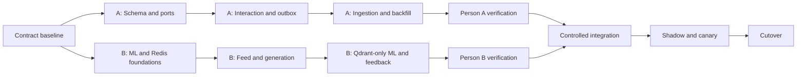

# WEave Backend–ML: Two-Person Parallel Work Plan

**Companion to:** `BACKEND_ML_PRODUCTION_ARCHITECTURE.md`  
**Purpose:** Divide the backend production plan between two engineers with minimal file overlap and explicit integration gates.  
**Planning unit:** A work window is a dependency-bounded block, not a guaranteed calendar deadline.

## 1. Recommended ownership split

### Person A — Data and Durable Events

Person A owns PostgreSQL, migrations, product-state correctness, interaction transactions, durable outbox persistence, ingestion persistence, data backfill, and database reconciliation.

Primary outcome:

> A retry-safe PostgreSQL system where every accepted interaction and repository change is durable, auditable, versioned, and ready for asynchronous delivery.

### Person B — Feed and ML Runtime

Person B owns feed delivery, Redis behavior, the backend ML client, feed-generation workers, Redis reconciliation, fallback behavior, and all required changes in `gh-social-ml`.

Primary outcome:

> A scalable feed/ML runtime that consumes frozen ports, uses canonical IDs, operates without online ML access to product PostgreSQL, and degrades safely.

### Why this split avoids conflicts

- Person A owns database-facing domain files.
- Person B owns feed/Redis/ML-facing files.
- Person B exclusively owns the `gh-social-ml` repository.
- Shared interfaces are frozen before parallel work begins.
- Shared bootstrap and package files have one merge owner.
- Each person can test their domain through ports and fakes before integration.

## 2. Branch and merge model

Create one integration branch from the same green baseline, then two work branches:

```text
feature/backend-v2-integration
├── feature/backend-v2-data-events       # Person A
└── feature/backend-v2-feed-ml           # Person B
```

For `gh-social-ml`, Person B uses a separate branch based on the agreed ML target branch:

```text
feature/backend-v2-ml-boundary
```

Rules:

1. Both branches start from the same contract-baseline commit.
2. Do not merge one person's incomplete branch into the other person's branch.
3. Rebase/merge the integration branch only at the end of a work window.
4. Person B is the merge captain for shared Node/bootstrap files.
5. Person A is the merge authority for migrations and schema files.
6. Person B is the merge authority for all `gh-social-ml` files.
7. Do not run repository-wide formatting while the branches are split.
8. Keep commits domain-scoped so a failed integration can be reverted without reverting unrelated work.

## 3. Frozen contract window — both people, before parallel coding

**Estimated window:** 0.5 day  
**Mode:** Sequential author/review, not simultaneous editing.

Person B authors the initial contract/port files. Person A reviews database semantics. Once approved, merge the contract-baseline commit before either person creates their long-running branch.

Create and freeze:

```text
backend/contracts/feed.v2.ts
backend/contracts/interactions.v2.ts
backend/contracts/ml.v2.ts
backend/contracts/ingestion.v2.ts
backend/ports/feedPersistencePort.ts
backend/ports/outboxTransportPort.ts
backend/ports/repositoryPersistencePort.ts
```

The contract commit contains types/interfaces only—no database, Redis, HTTP, or ML implementation.

### 3.1 Port Person A must implement

```ts
interface FeedPersistencePort {
  getFeedVersion(userId: string): Promise<bigint>;
  getServeByRequest(userId: string, feedRequestId: string): Promise<StoredServe | null>;
  createServe(input: CreateServeInput): Promise<StoredServe>;
  listActiveRepositories(repoIds: string[]): Promise<RepositoryProjection[]>;
  getTrendingFallback(limit: number, excludeRepoIds: string[]): Promise<RepositoryProjection[]>;
}

interface RepositoryPersistencePort {
  bulkUpsert(input: RepositoryUpsert[]): Promise<RepositoryUpsertResult[]>;
  recordTrendingSnapshot(input: TrendingSnapshotInput): Promise<TrendingSnapshotResult>;
}
```

### 3.2 Port Person B must implement

```ts
interface OutboxTransportPort {
  deliverFeedback(batch: MlFeedbackBatch): Promise<DeliveryResult>;
  deliverOnboarding(job: MlOnboardingJob): Promise<DeliveryResult>;
  deliverRepositoryIndex(job: MlRepositoryIndexJob): Promise<DeliveryResult>;
  deliverRepositoryRefresh(job: MlRepositoryRefreshJob): Promise<DeliveryResult>;
}

interface RecommendationPort {
  generate(input: MlRecommendationRequest): Promise<MlRecommendationResponse>;
}
```

### 3.3 Contract decisions that cannot change independently

- Canonical repository identity is backend `repo_id` UUID.
- GitHub numeric ID is the external upsert key.
- `full_name` is never an event/feed identity.
- Event IDs and feed request IDs are mandatory UUIDs.
- Feed and feedback versions are monotonic backend-assigned integers.
- Canonical actions are fixed to the v2 list in the main architecture.
- Redis recommendation entries and ML responses use the exact v2 fields.
- A contract change requires both people to approve a new contract-baseline commit.

## 4. Strict file ownership

### 4.1 Person A files

Person A may create or modify:

```text
database/migrations/**
database/backfills/**
database/audits/**

backend/db/**
backend/scripts/schema-audit.*
backend/scripts/backfill-*.ts
backend/scripts/reconcile-*.ts

backend/services/activityService.ts
backend/services/outboxService.ts
backend/services/sessionService.ts
backend/services/ingestionService.ts
backend/services/trendingService.ts
backend/services/feedPersistenceService.ts

backend/controllers/activityController.ts
backend/controllers/ingestionController.ts
backend/controllers/trendingController.ts

backend/routes/activityRoutes.ts
backend/routes/ingestionRoutes.ts
backend/routes/trendingRoutes.ts

backend/workers/outboxWorker.ts
backend/workers/dataReconciliationWorker.ts
backend/workers/retentionWorker.ts

backend/adapters/postgresFeedPersistence.ts
backend/adapters/postgresRepositoryPersistence.ts

backend/tests/data/**
backend/tests/interactions/**
backend/tests/outbox/**
backend/tests/ingestion/**
```

Person A exclusively owns migration numbering, migration metadata, database functions, grants, constraints, and schema declarations.

### 4.2 Person B files

Person B may create or modify:

```text
backend/config/redis.ts
backend/config/ml.ts

backend/services/feedService.ts
backend/services/mlService.ts
backend/services/feedGenerationService.ts

backend/controllers/feedController.ts
backend/routes/feedRoutes.ts

backend/workers/feedGenerationWorker.ts
backend/workers/feedReconciliationWorker.ts

backend/redis/**
backend/adapters/mlOutboxTransport.ts
backend/adapters/mlRecommendationAdapter.ts

backend/observability/**

backend/tests/feed/**
backend/tests/redis/**
backend/tests/ml-contract/**
backend/tests/fallback/**

gh-social-ml/api/**
gh-social-ml/retrieval/**
gh-social-ml/retrieval_engine.py
gh-social-ml/feedback/**
gh-social-ml/embedding/**
gh-social-ml/inference/**
gh-social-ml/tests/**
```

Person B exclusively owns the online ML boundary and the removal of online ML PostgreSQL dependencies.

### 4.3 Shared files — Person B edits during integration only

Neither person edits these during the independent windows unless the change is explicitly queued for the integration window:

```text
backend/app.ts
backend/server.ts
backend/package.json
backend/package-lock.json
backend/tsconfig.json
backend/types/env.d.ts
.env.example
docker-compose.yml
```

Person A records requested scripts, dependencies, environment variables, and route registrations in:

```text
docs/handoffs/person-a-integration-requests.md
```

Person B applies those changes once when integrating. This prevents repeated lockfile, bootstrap, and environment conflicts.

### 4.4 Files frozen after the contract window

```text
backend/contracts/**
backend/ports/**
```

If a frozen interface is insufficient:

1. Open a small contract-change commit.
2. Both people review it.
3. Merge it into the integration branch.
4. Both work branches adopt that single commit at the next window boundary.

Do not independently patch the same contract on both branches.

## 5. Work window overview

| Window | Person A | Person B | Parallel? | Exit gate |
|---|---|---|---|---|
| 0 | Fix backend baseline/build | Stabilize ML baseline/tests | Yes, separate repos/files | Both baselines green; contracts frozen |
| 1 | Expand schema, roles, audit | ML v2 identity/auth/Qdrant foundation | Yes | Empty DB migration and ML contract tests pass |
| 2 | Interaction transaction and outbox | Feed v2, reservations, generation | Yes through ports/fakes | Domain integration tests pass independently |
| 3 | Ingestion, trending, backfill | Qdrant-only ML and feedback ordering | Yes | No online ML DB dependency; backfill report clean |
| 4 | DB/recovery/interaction chaos tests | Feed/Redis/ML/load chaos tests | Yes | Both test matrices green |
| 5 | Migration and data integration | Runtime wiring and shared files | Partly; controlled merge | Staging end-to-end passes |
| 6 | Production data/cutover support | Canary/runtime/cutover support | Yes by operational role | Release gates and soak period pass |

Durations below are estimates for planning. Do not skip an exit gate to preserve a date.

## 6. Window 0 — green baseline and contract freeze

**Estimated duration:** 0.5–1 day

### Person A tasks

#### A0.1 Fix the current backend compilation failure

- Correct the `activityService.ts` raw result handling.
- Preserve existing behavior; do not start the v2 rewrite in this commit.
- Run `npm run build` in `backend`.

Acceptance:

- Backend TypeScript build succeeds.
- The fix has a focused regression test or a documented test seam if the harness is not yet available.

#### A0.2 Record live schema inputs

- Capture catalog assumptions from the source plan.
- Produce a table/object inventory template for later audit.
- Do not mutate live Supabase.

Output:

```text
docs/handoffs/person-a-live-schema-inventory.md
```

### Person B tasks

#### B0.1 Stabilize checked-out ML feedback tests

- Identify the feedback-test failures and teardown hang.
- Make the relevant focused tests pass and terminate reliably.
- Avoid production-boundary refactors in the baseline-fix commit.

Acceptance:

- Focused feedback suite passes.
- Full ML test command has a documented runtime and no hang.

#### B0.2 Establish backend test tooling

- Add the chosen backend test runner and scripts.
- Own all package and lockfile changes.
- Add empty domain test directories or smoke tests without touching Person A service files.

Acceptance:

- `npm test` or the agreed equivalent runs in CI/local development.
- Build, lint, and test scripts have stable names used by both people.

### Joint gate

- Pair-review and merge the frozen contract/port files from Section 3.
- Create both work branches from this exact commit.

## 7. Window 1 — persistence foundation versus ML foundation

**Estimated duration:** 2–3 days

### Person A tasks

#### A1.1 Create additive `app` and `telemetry` schema

Implement the tables from the main architecture:

- Users, stats, feed state, topics.
- Canonical repositories, content, snapshots, engagement, summaries.
- Reactions, saves, follows, comments, boards.
- Trending snapshots/items.
- Sessions, serves/items, interaction events, engagement rollup, ML outbox, generation attempts.

Constraints:

- Additive only; no legacy drop/rename.
- Canonical repo UUID plus unique GitHub numeric ID.
- Event ID and feed request ID idempotency constraints.
- Required indexes for workers and hot reads.
- Raw SQL for extensions, roles, grants, functions, and constraints not safely generated by Drizzle.

#### A1.2 Replace migration runner

- Introduce Drizzle migrator behavior.
- Define baseline adoption for live history instead of pretending live is empty.
- Keep migration execution separate from API startup.

#### A1.3 Build schema audit

Audit:

- Tables/columns/types/defaults.
- PK/FK/unique/check constraints.
- Indexes and functions.
- Roles/grants/default privileges.
- Migration hashes/history.
- Expected schemas and prohibited exposure.

#### A1.4 Database tests

- Empty database migration.
- Migration re-run/no-op.
- Role and grant tests.
- Constraint and index existence tests.

Person A exit gate:

- Migration and audit pass on a disposable database.
- Legacy runtime remains untouched.
- No Person B-owned file changed.

### Person B tasks

#### B1.1 Implement canonical ML v2 types and validation

- Implement v2 request/response models in FastAPI.
- Protect feedback with internal authentication.
- Return flat typed recommendation items.
- Include generation, feed, model, and embedding versions.
- Reject malformed/duplicate/non-finite recommendation entries.

#### B1.2 Canonicalize Qdrant identity

- Use backend `repo_id` UUID directly as the Qdrant point ID.
- Preserve GitHub ID and `full_name` as payload metadata only.
- Add tests for rename behavior and duplicate identity schemes.
- Design a controlled reindex report; do not delete old points yet.

#### B1.3 Prepare Redis reservation primitives

Implement/test in isolation:

- Versioned feed keys.
- Token-based generation locks.
- `reserve.lua`, `commit.lua`, and `release.lua` behavior.
- Expiration and ownership checks.

#### B1.4 Build typed backend ML adapters against fakes

- Make `mlService.ts` implement the frozen recommendation and outbox transport ports.
- Add strict timeouts, response limits, retry classification, and correlation headers.
- Do not require Person A's database implementation.

Person B exit gate:

- ML contract/identity/auth tests pass.
- Redis script unit/integration tests pass.
- Backend ML adapters pass against mocked ML responses.
- No Person A-owned file changed.

## 8. Window 2 — interaction/outbox versus feed/generation

**Estimated duration:** 3–4 days

### Person A tasks

#### A2.1 Implement idempotent interaction transaction

In `activityService.ts`:

1. Validate data passed from controller.
2. Begin one bounded transaction.
3. Lock user feed state.
4. Insert event and short-circuit duplicates.
5. Lock reaction/save rows deterministically.
6. Apply explicit target-state transitions.
7. Update exact counter deltas and engagement rollups.
8. Assign monotonic feedback versions.
9. Bump feed version only when policy requires it.
10. Insert outbox rows.
11. Commit before any network work.

#### A2.2 Implement v2 interaction controller

- Validate full batches before transaction.
- Authenticate user from claims.
- Verify serve/repository/position relationships.
- Return accepted/duplicate statuses and versions.
- Remove fire-and-forget ML calls.

#### A2.3 Implement outbox persistence and worker

- Claim with `FOR UPDATE SKIP LOCKED`.
- Use short claim transactions.
- Deliver through the frozen `OutboxTransportPort` only.
- Implement leases, retries, jitter, dead rows, and audited replay.
- Group compatible rows into bounded batches.

#### A2.4 Interaction/outbox tests

- Full action/reversal matrix.
- Duplicate IDs.
- Concurrent opposing events.
- Rollback behavior.
- Exact counter/version/outbox effects.
- Worker claims, lease recovery, retries, and dead-letter replay with fake transport.

Person A exit gate:

- Product transaction is correct without Redis or ML.
- Duplicate side effects are zero in concurrency tests.
- Outbox tests pass through a fake Person B transport.

### Person B tasks

#### B2.1 Rewrite feed service through persistence port

- Require feed request/session IDs.
- Read feed version through `FeedPersistencePort`.
- Return stored serve on request replay.
- Consume only typed canonical-ID Redis entries.
- Hydrate repositories in a bounded batch through the port.
- Return the v2 serve envelope.

#### B2.2 Implement reservation saga

- Reserve queue head by feed request ID.
- Ask the persistence port to create a serve.
- Commit or release reservation based on result.
- Make retries return the same serve.
- Expose repair operations to the feed reconciliation worker.

#### B2.3 Implement generation worker

- Coalesce by `(user_id, feed_version)`.
- Use token/version locks.
- Call the frozen recommendation port.
- Validate all returned IDs/versions/scores.
- Reject stale results after re-reading the feed version.
- Populate bounded queues and trigger low-water replenishment.
- Use fallback after the request wait budget expires.

#### B2.4 Feed tests

- Cache hit/miss.
- Duplicate feed request.
- Concurrent miss coalescing.
- Version change during generation.
- Reservation crash boundaries.
- Unknown/duplicate/inactive ML IDs.
- ML timeout and trending fallback.

Use in-memory/fake `FeedPersistencePort`; do not wait for Person A's adapter.

Person B exit gate:

- Feed domain passes without a real database.
- No bare array response remains in v2.
- Redis failures produce controlled fallback behavior.

## 9. Window 3 — ingestion/backfill versus production ML boundary

**Estimated duration:** 2–3 days

### Person A tasks

#### A3.1 Implement internal repository ingestion

- Strictly authenticate the internal endpoint.
- Bulk upsert by GitHub numeric ID.
- Preserve canonical UUID across rename.
- Store content hash/version and snapshots.
- Create `repo_index`/`repo_refresh` outbox jobs only when relevant content/features changed.
- Return canonical mappings.

#### A3.2 Implement trending snapshot ingestion

- Validate complete snapshots before transaction.
- Upsert repositories first.
- Atomically activate a complete snapshot.
- Create Qdrant refresh outbox work.
- Provide latest-snapshot fallback reads through the persistence port.

#### A3.3 Build deterministic backfills

Implement and report:

- Users/auth links.
- Repositories and legacy-to-new ID map.
- Reactions/saves.
- Social/board/comment state.
- Trending and summaries.
- Counts, rejects, orphans, checksums, and no-op rerun.

#### A3.4 Data reconciliation and retention workers

- Recompute counter drift.
- Reset abandoned outbox claims.
- Create future telemetry partitions.
- Prune delivered operational rows by retention policy.

Person A exit gate:

- Backfill is idempotent with zero unexplained loss on a clone.
- Ingestion never requires ML database access.
- Fallback snapshot reads meet the persistence contract.

### Person B tasks

#### B3.1 Remove online ML PostgreSQL dependency

Remove online use of:

- `Repo` hydration.
- `trending_repositories` retrieval.
- `user_recommendation_batches` caching.
- Product counter updates.
- Product feedback-state storage.
- Backend feed-cache invalidation.

The online ML service must start, recommend, onboard, embed, and accept feedback with no `DATABASE_URL`.

#### B3.2 Implement Qdrant-only candidate retrieval

- Semantic retrieval.
- Trending/activity/popular/fresh discovery scans.
- Deduplication by canonical repo UUID.
- Payload/vector completeness checks.
- Bounded candidate pool and cold-start fallback.
- Flat ranked results with model metadata.

#### B3.3 Implement ordered feedback application

- Preserve backend event ID and feedback version in Redis Streams.
- Disable silent in-memory fallback in production.
- Serialize processing per user.
- Skip duplicate versions.
- Hold/retry version gaps.
- Store updated vector and `last_feedback_version` together.
- Reclaim pending messages from crashed consumers.
- Expose consumer lag and real health.

#### B3.4 Implement feed reconciliation and fallback runtime

- Restore/commit expired reservations by consulting the persistence port.
- Clean stale versioned cache keys.
- Add circuit breaker metrics.
- Ensure database-backed trending fallback remains available when ML is unavailable.

Person B exit gate:

- Online ML passes with `DATABASE_URL` absent.
- Canonical Qdrant reindex comparison is clean.
- Duplicate/version-gap feedback tests pass.
- Feed reconciliation tests pass against fake persistence.

## 10. Window 4 — independent verification and chaos testing

**Estimated duration:** 2 days

### Person A tasks

- Migration on empty database.
- Migration on production-like clone.
- Re-run/no-op verification.
- Schema/grant audit.
- Backfill checksum and orphan report.
- Interaction concurrency and deadlock tests.
- Outbox multi-worker, lease, retry, and replay tests.
- PostgreSQL connection exhaustion and lock-timeout tests.
- Counter drift detection/reconciliation test.
- Restore drill instructions and role recreation checklist.

### Person B tasks

- Feed cache-hit load test.
- Cold-cache generation stampede test.
- Redis restart at every reservation stage.
- ML timeout/`429`/`5xx`/invalid-contract tests.
- Qdrant outage and degraded ranker tests.
- Feedback Stream consumer crash/reclaim tests.
- Canonical Qdrant identity/duplicate report.
- Online ML no-database soak test.
- Feed fallback SLO test.

Parallel exit gate:

- Each person publishes their report without editing the other person's report:

```text
docs/handoffs/person-a-verification.md
docs/handoffs/person-b-verification.md
```

## 11. Window 5 — controlled integration

**Estimated duration:** 1–2 days

This is the first window where the implementations are wired together. Avoid both people editing shared files simultaneously.

### Integration order

1. Merge the contract-baseline commit if not already present.
2. Merge Person A's data/events branch.
3. Person A resolves only migration/schema conflicts.
4. Merge Person B's feed/runtime branch.
5. Person B resolves only feed/Redis/ML conflicts.
6. Person B applies shared-file integration requests once.
7. Wire Person A PostgreSQL adapters into Person B feed service.
8. Wire Person B ML transport into Person A outbox worker.
9. Register routes/workers/configuration.
10. Run combined build, tests, migrations, and end-to-end flows.

### Person A integration responsibilities

- Verify generated SQL and migration order did not change during merge.
- Seed the staging database.
- Validate transaction/outbox/serve records during end-to-end tests.
- Own database fixes discovered by integration.
- Do not edit feed/ML implementations.

### Person B integration responsibilities

- Edit shared bootstrap, package, lockfile, environment, and process scripts.
- Wire dependency injection/adapter construction.
- Run backend-to-ML contract tests.
- Own Redis/feed/ML fixes discovered by integration.
- Do not edit migrations or database state logic.

### Combined flows that must pass

1. Repository bulk upsert → outbox → ML embed → Qdrant point with canonical ID.
2. Onboarding commit → outbox → user vector → feed prewarm.
3. Feed miss → ML generation → Redis queue → reservation → serve persistence → response.
4. Duplicate feed request → same serve/items.
5. Like/dislike/save batch → product state/event/version/outbox commit.
6. Outbox retry → ML accepts once → Qdrant feedback version advances once.
7. Interaction during generation → stale result discarded.
8. ML/Redis failure → trending fallback without product-state loss.

Integration exit gate:

- Build/lint/tests pass in both repositories.
- Schema audit is clean.
- Dead outbox rows are zero.
- Unknown ML repository IDs are zero.
- All combined flows pass with correlation IDs visible end to end.

## 12. Window 6 — shadow, canary, and cutover

**Estimated duration:** Determined by soak evidence, not coding speed.

### Person A operational role

- Run/observe backfill and reconciliation.
- Watch database locks, connections, slow queries, WAL, partitions, counters, and outbox age.
- Validate live serve/event/outbox records during cohorts.
- Own database feature flags and write/read cutover gates.
- Maintain backup/restore readiness.

### Person B operational role

- Run/observe shadow feed generation and Qdrant comparisons.
- Watch Redis memory/evictions/latency/reservations and ML/Qdrant latency.
- Own feed, ML, fallback, and Qdrant-only feature flags.
- Increase canary cohorts only when runtime SLOs pass.
- Maintain runtime fallback readiness.

### Cutover order

1. New interaction writes and outbox.
2. Feed versions and reservations.
3. ML v2 recommendations and canonical Qdrant identity.
4. New product reads.
5. Gradual cohort expansion.
6. Legacy read-only window.

Both people must approve each gate. One approval is insufficient for a cross-domain cutover.

## 13. Task dependency map



The parallel tracks meet only through frozen ports until controlled integration.

## 14. Daily coordination without task collision

Use a short daily sync limited to:

- Contract questions.
- Newly discovered dependency changes.
- Test fixtures needed by the other track.
- Environment/dependency requests for the integration list.
- Risks that may block the next exit gate.

Do not use the sync to transfer file ownership informally. Update this ownership plan first.

Each person maintains a domain handoff log:

```text
docs/handoffs/person-a-status.md
docs/handoffs/person-b-status.md
```

Minimum daily entry:

```text
Completed:
Next:
Blocked:
Contract change requested:
Integration request:
Tests run:
```

## 15. Conflict prevention checklist

Before every commit:

- File is inside the engineer's ownership list.
- No repository-wide formatter or import sorter touched unrelated files.
- No contract/port changed without joint approval.
- No migration generated by Person B.
- No ML file changed by Person A.
- No lockfile/bootstrap/environment file changed outside integration by Person A.
- Tests are domain-scoped and placed in the owner's directory.
- New environment/dependency request is recorded for integration.
- Commit contains one reversible task outcome.

Before every window merge:

- Domain exit gate passed.
- Handoff/status document is current.
- Build and domain tests pass.
- No uncommitted generated migrations, snapshots, lockfiles, or model artifacts.
- Any contract change has already landed as a shared baseline commit.

## 16. Pull request structure

Prefer small PRs within each track:

### Person A PR sequence

```text
A-01 baseline build fix
A-02 app/telemetry schema and migrations
A-03 roles, grants, and schema audit
A-04 interaction transaction
A-05 outbox service and worker
A-06 repository/trending ingestion
A-07 backfill and reconciliation
A-08 data verification report
```

### Person B PR sequence

```text
B-01 ML test stabilization and backend test harness
B-02 ML v2 contracts/auth/identity
B-03 Redis reservation scripts
B-04 typed ML client/adapters
B-05 feed v2 and generation worker
B-06 Qdrant-only retrieval
B-07 ordered feedback consumer
B-08 feed reconciliation/fallback and verification report
```

Do not make one PR contain an entire track. Each PR must be testable and revertible.

## 17. Person A definition of done

Person A's track is complete when:

- Additive migrations work on empty and production-like databases.
- Schema audit and role/grant checks pass.
- Backfill is idempotent with zero unexplained loss.
- Repository rename preserves canonical identity.
- Interaction retries produce no duplicate state/counter/outbox effect.
- Feed and feedback versions are monotonic under concurrency.
- Outbox workers recover claims, retry safely, dead-letter visibly, and replay audibly.
- Trending fallback data is complete and atomically activated.
- Data retention/reconciliation jobs are tested.
- Person B can consume all required behavior through the frozen ports.

## 18. Person B definition of done

Person B's track is complete when:

- Feed v2 is idempotent by feed request ID.
- Redis reservations recover from every crash boundary.
- Concurrent misses coalesce by user/feed version.
- Stale generation results are rejected.
- ML timeouts and Redis failures return a bounded trending fallback.
- ML v2 endpoints are authenticated and strictly typed.
- Qdrant uses canonical backend UUID identity with no unexplained duplicates.
- Online ML starts and operates with no product `DATABASE_URL`.
- Feedback preserves event/version, applies in order, skips duplicates, and reclaims crashed work.
- Person A's outbox worker can use the ML transport port without importing ML implementation details.

## 19. Combined definition of done

The two tracks are complete only when:

1. Both repositories build and all relevant tests terminate and pass.
2. The database and Qdrant agree on canonical active repository IDs.
3. A feed item can be traced through generation, Redis, serve persistence, interaction, outbox, ML Stream, and Qdrant feedback version.
4. Product state remains correct when ML, Qdrant, or Redis is unavailable.
5. Fallback, retry, replay, backup, and reconciliation procedures have been executed successfully.
6. Shadow/canary SLOs and correctness gates pass for the agreed soak period.
7. Both Person A and Person B approve production cutover.

## 20. Quick assignment card

### Give Person A

```text
Own database/migrations/schema.
Own interaction transaction and product state.
Own outbox persistence/worker through a transport port.
Own repository/trending ingestion and backfills.
Own data reconciliation, partitions, roles, audits, and DB tests.
Never edit feed/Redis/ML files or shared bootstrap files.
```

### Give Person B

```text
Own feed API/service, Redis, reservations, generation, and fallback.
Own backend ML client/adapters and runtime observability.
Own all required gh-social-ml changes.
Own Qdrant-only retrieval, canonical identity, and ordered feedback.
Own shared Node/bootstrap/package/env integration changes.
Never edit migrations, schema, activity state, or backfill files.
```

### Shared rule

```text
Freeze contracts first. Work through ports and fakes. Merge only at window gates.
```

